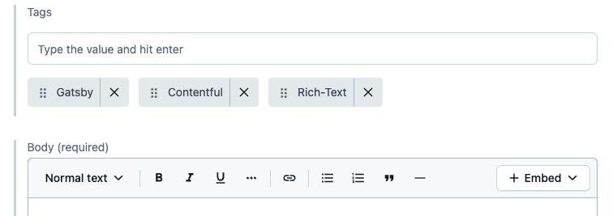
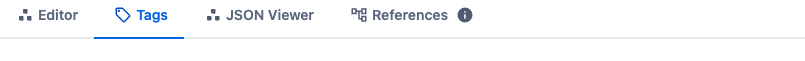
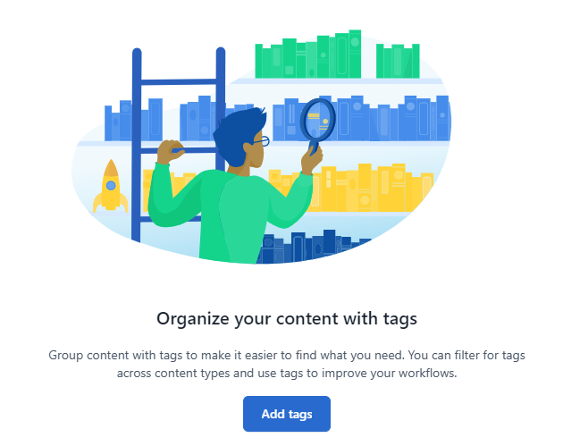
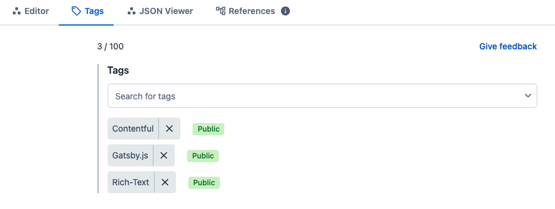

Contentfulは、何というかHello Worldなお世界というか、あぁこれが世界かぁ！と井の中の蛙、今更に大海を知るみたいなワクワク感がたくさんあって。

まずは「Locale設定」で記事が2つずつ重複表示されたときに、日本語あるいはOne-languageでしか記事を書くつもりがない人間には、一見迷惑な高機能に思えるのだが、--hoge.com/jp/とか、--hoge.com/en/とか・・・あぁこうやって世界同時発信みたいなことができちゃうわけか！とお上りさん興奮しまスた。なユーザー体験にはじまり

Starterとして使っているContentful社製テーマのお作法がとても潔く正しいところも気に入っている。

たとえば、[Bolg](/blog)トップページでWordPressみたいな抜粋文...文字数上限まで自動抽出 -
といったルーズ作法でなく、ディスクリプションを最初から指定されてて、（そだよね。記事概要くらい筆者が書くべき、そらそうだ）と本当に今更まともなことを突きつけられた気になったり。
___

### で。本題のTagsの話

Starterでは最初から全ての見本記事にTagがつけられており、[Bolg](/blog)トップページにあるTag表示も、componentsに用意されていた。



**Editor** でも記事の中に入力フィールドが。
___

しかし、**Editor** 上のタブが気になる。



タブを切り替えると、こんなイラスト付きでお薦めしてくる。

___

使いはじめてみると、この絵の最適解ぶりがわかるんですが、**Content model**
/ **Content Type** の垣根なしにContentfulのステージにあるもの全てから検索・フィルタリングができる優れものらしいんですね。
___

私は個人使いでしかも日が浅い・記事もメディアも少ない・で、宝の持ち腐れてますが、プロジェクト毎に紐づけられたり、チーム名をつけられたり、年度をサクッと分けられたり、（済）マークだって良いわけで、用途を想像すると素晴らしい。
Twitterのハッシュタグのようなイメージですかねぇ。<br>
&emsp;

というかハッシュタグの語源 **hash** がプログラム関数で便利なもの、だけど最初は理解が難しいものでしたね。<br>
遠い昔に家人から「ハッシュド・ビーフてのがあるだろう？」と習った記憶がありますが。<br>
&emsp;

閑話休題。

実際に**Blog Post**にTagsを設定した画面。



Contentful Tagsは、
**private** /or/ **public** を最初に決めるので、Contentfulのステージ内でプライベートに使う用途でない場合、つまり**Blog Post**のように外から取り出して使いたい場合は **public** で登録します。
___

Starterで最初についていたTagsは、GraphQLとしては
```graphql:title=graphql---BlogPost.tags
allContentfulBlogPost {
    nodes {
      title
      slug
	  body
	  tags
	  ...
```
と、BlogPostモデルの中にありました。

## Contentful Tags の場合

2つの取り出し方があるので、実装も楽。

```graphql:title=graphql---BlogPost.metadata.tags
allContentfulBlogPost {
          nodes {
            title
            slug
            metadata {
              tags {
                contentful_id
                name
              }
            }
          }
        }
```

```graphql:title=graphql---ContentfulTag.
allContentfulTag {
          nodes {
            contentful_id
            name
          }
        }
```
<br>

___

**gatsby-node.js** での **createPage** がとても楽にできそうだ、というのは **GraphQL** を少し触ったことがあれば一目瞭然。

ただBlog Postの方で、開発環境では簡単に設定できたはずが、Buildエラーが出てしまうなど作業後半で困惑した部分がありました。<br>
理由がわかると、当然といえば当然かっ！な原因でしたが、何せ情報が少ない。<br>
&emsp;

Gatsby.jsでTagsという頭の硬さでググったのが敗因とも言えますが、Gatsbyで, Contentfulで, Markdown勢のfrontmatterではなく！とニッチをいくと酸味を味わうことになりますが・・・

わたくし**スッパムーチョ**とか酸味・大好き人間。<br>
この機会にChatGPTと触れ合ったりして **←** 一方的に縋りついただけ<br>
すげぇなぁこの人！ と感動したり。**←** だから。人ではない。

苦労・辛酸を舐めても成果物さえできてしまえば、過程もまた楽し。と振り返る余裕でき。<br>
思ったより長い記事になったので、分割掲載にします。

<!-- EOF -->