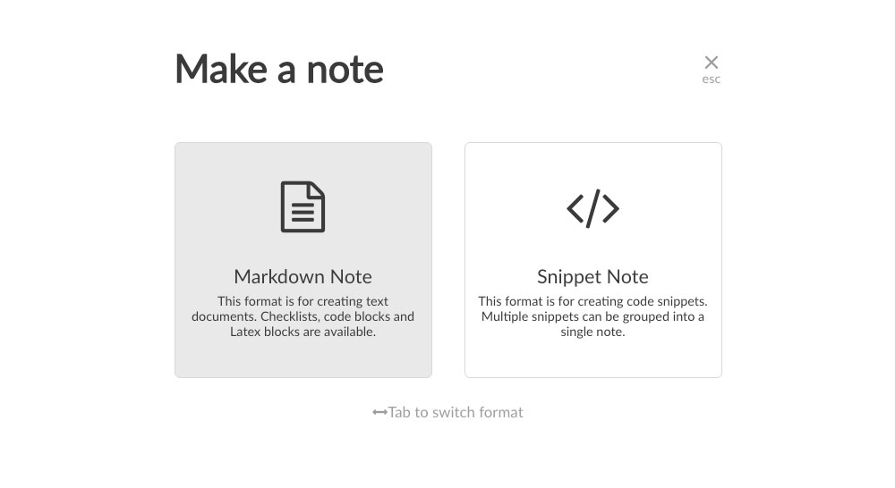

ContentfulのリッチテキストEditorが少し使いづらい、というのはブログにも書いたのですが、では使いやすいというMarkdown Editorの方を使い出したか、というとそうでもなくて。

情報発信よりもまずつくることを目的としているような輩にとって、ブラウザが読んでくれるHTMLを大量に書き出すのに何がいちばん早いか、というと

Emmet で書けるVs codeに勝るものはなく。

実際のところMDでPostを書くよりも、[About](/about/)ページをつくる作業の方が単純で簡単。

これはもう要素はHTMLタグとTextとCSS、レイアウトはCSS Gridでデバイス毎のレスポンシブを分けるだけ。<br>
サイトのHeader Footerなどは既にあるcomponentsを個々に借りてくるまでもなく、Layout components に配置するだけ。

まだ小規模ですが、こんな単純明快なFSEあるかぁっ　という感覚。<br>
JSファイルの中でEmmetを使えるようにセッティング済みなので、煩わしいのは日本語と半角英数の切り替えだけ、と最低限負荷でできる理想的な環境なわけですが、Pre/Codeだけは中に書けない。

で、やむなき選択肢がMarkdownだった。


<hr>

CMS Editor < Markdown < html < html on JS

不等式で書くとこんな感じ。<br>
素のhtmlより、JS上で書くのが楽か？　というのはcomponents利用や、ブロック開閉など監視しててくれるデバッグが頼りになる、ホットリロードもあるという嬉しい付録つき部分が理由。

今のところContentfulには、他のStarterを試したときに自動で作ってくれたContent Modelも使わず放置してあり、いつでもGraphQLで紐付けられるくらいの知見は身についた・・・て大袈裟な。<br>
「GraphQLの使い勝手もわかった、怖くねぇ！くらいになった」今段階で活用しても良いのだけど

結局、この人間とファミレスで雑談してたとして、なんと応えるか。

&emsp;<br>
<blockquote>
・・・君はつまり「Github Pages」とBlogのようなものが両方あればいいんじゃない？
</blockquote>

<br>&emsp;<br>
翻訳するとファイルをPutするだけで良い環境と、入力するだけで新規ファイルをCMSに追加してくれる便利ツールの両方あれば満足なんだろう。<br>
とはとっくに気づいていたわけで、そのように整えた。

そう、PagesとBlog Posts - この規模でサイトをつくるときGatsbyは導入コスト・制作時間コストともに、抜群なハンサムを感じたのが惚れた理由だ。まるで太陽がいっぱいのアラン・ドロンだね。

&emsp;<br>

GatsbyのThemaを「複数・同居させられる」という機能とは違うものの<br>
そんなことまで出来るフレームワークで、リッチテキストとMarkdown、CMSとリポジトリ、使い分けるのは容易かろう⭐️
で作業スタート。

&emsp;<br>
一応まじめにOutput/Inputのバランスとコストは30分くらい（うーん。）と比較検討してみました。

現状での欠点としては、「Contentful Tags」で両コンテンツを跨いでの検索はできない - がOutputの唯一欠陥と見えるが、Input/Editコストが高いと続かないため、ここはOutput/Inputで「Input」を優先するなど「二択・双六」したですね。
<br>
<blockquote>
あれ。雑誌でよくあるYes or Noで進んでいくと、あなたはAタイプBタイプ・・・と結果が4種類くらいあるやつ、なんと呼ぶんだろう。（思いつくのはイフゼン文・図）<br>・・・ぐ。気になってググったら「Yes/Noチャート」だそう
</blockquote>
<br>

・・・と脱線から戻って、そもNotesの方では検索やTag絞りなど必要ない。と思っていても、「人は気が変わるし、状況も変わる」と前提した場合、少し考えると、**実装しようと思ったら出来る** 許容範囲も見えてくる。

Jekyll資産だという「frontmatter」は好きなときに好きなだけ増やせる、ということは[BlogにTags機能をつける工程](/note-03/) で使った

```js:title=createPage
context: {
	slug: tag.contentful_id,
	name: tag.name,
	},
```
```js:title=ID&name
const =	result.data.allContentfulTag.nodes.contentful_id
const =	result.data.allContentfulTag.nodes.name
```
住所番地と名前を持った（値）と合同フィルターをかけられる（値）をMD「frontmatter」側にも追加すれば良いと想定し、数学の・・・いや算数か？ &emsp; 最小公倍数、最大公約数の円が重なった図解に似たことを、遠い将来もしやりたくなったときは、CMSを通したMDよりローカルリポジトリにあるMDが楽そうだ。

などなど。記事追加時の手間の差とかを比較。
<hr>

ローカルリポジトリ → Github mainリポジトリ → Gatsby Cloud（Build）<br>
CMS:Contentful → Published → Gatsby Cloud（Build）<br>

本来、世間的には下の方が楽なはずだけど、ログインして、記事を書いて、公開ボタン押して、よりも
Vs codeが勝つのは仕方ない。何せText-Editorという職人であり、Code-Editorという職人頭だ。

&emsp;<br>

Inputでの欠点は、ただひたすら私の不当なMarkdown毛嫌いだけ（汗）<br>
**彼女はHTMLというMarkup言語を愛しすぎてる** &emsp; 問題とでも呼ぼうか、インデントのないテキストが苦しみに至る病と呼ぶべきか。

ようやく4つめ記事で慣れてはきたけども。<br>

# このHeadingもろくに書かぬ手抜きに至る

とまぁ、contentsの善し悪しは所詮人間性だべや。な点には睫毛を伏せて応えまして、先へ進む。
<hr>

JSファイルで汎用性のある記事構成は（Pre/Codeを載せる限り）難しいとわかり、Markdown採用を決めてから、[Gatsbyを使ったブログをスクラッチから構築するための基礎](https://reffect.co.jp/react/gatsby-update)このままの手順をゆっくり読みながらドリルみたいに実践していきました。

特に面白かったのが、ファイルシステムの情報取得で、外に見せるものをサクッとつくって終わり・・ではない、じっくりと噛み締めるように進む解説がとても親切で、本当の勉強になりました。

```graphql:title=edge.node.
{data.allFile.edges.map((edge) => (
	<tr kye={edge.node.ctime}>
		<td>{edge.node.relativePath}</td>
		<td>{edge.node.size}</td>
		<td>{edge.node.ctime}</td>
	</tr>
	))}
```
Starterの稼働している中にサブディレクトリで適用していった他は、多く転記利用させていただき。

またプラグインの1つ1つの説明が丁寧で！<br>
目的が何で、どこに使うのか見直しながら **gatsby-config.js** を再編集するなど（復習ってすごく大事）🥰　を実感する良い機会になりました。・・・深謝。

## 人は嘘をつくが時計は嘘をつかない

Starterに揃える以外で、変えた箇所といえば、frontmatter/date: "2023-06-06 10:00:00" を時間まで書くようにしたことくらい。<br>

続き連載や、同日に複数投稿があったときに、1日くらい日付操作をしたってPostとして旬も、非・旬（older）の意味にも差は出ないけれど、時間を足すと、1日の中で 24 * 60 * 60　と365日とは比較にならないソートが成り立つので。（←86,400倍もいらんけど）

この記事の前2件が同日で似た文字列のタイトルながら、時間を書き換えると上下がコロコロ入れ替わるので

(sort: {frontmatter: {date: DESC}})　は時間を表示していなくても、n時n分n秒まで有効とわかります。<br>
&emsp;<br>


残るは、CMSのMarkdown Editorに頼らない場合、Previewはどうするんだ - な点。<br>

一般的には、記事一つ書くのにGtasby developで開発環境を立ち上げて・・というのは現実的でないからみなさんCMSを使うという側面もあると思う。

が、うちの場合はMac iTermが閉じてることはないので、これが最短であったりする。<br>
開発と本番でプッシュ先のリポジトリ切り替えはするけれども、だからこそ遠慮なく下書きも残せるのと<br>
ホットリロード > Preview　の確実性。<br>
&emsp;<br>

Vs code拡張機能などもあるはずですが、とりあえずMDファイル内でもEmmetを使えるようにだけにした。

```js:title=setting.json
"emmet.excludeLanguages": [],
"emmet.includeLanguages": {"markdown": "html"},
```
普通はこの書き方で良いらしい。<br>
.includeLanguages だけでは有効にならないので、.excludeLanguagesも併記するとあったが、うちは先住民がさらにいて　↓こんな感じに。

```js:title=setting.json
"emmet.variables":{
	"lang": "ja"
},
"emmet.excludeLanguages": [],
"emmet.includeLanguages": {
	"javascript": "javascriptreact",
	"markdown": "html",
},
```
<br>

あとは、Markdownを単体書きしたいときは、先に自前調達でローカル版「Boost Note」を持っていたので、Localhostが寝ている時も書くだけは書ける。

現在広く知られている「Boost Note」前身のローカル版「Boost Note」、長年未使用だったくせに最近一代前のiMacからコピペ移植してきて非常に重宝している。
<hr>

Markdownの弱みは改行コード周りが曖昧、というか「縦スペースの表現が苦手」<br>
だからってBRタグを連続挿入して良いのかって・・・悩ましいが<br>

むかし人はタイプライターで、キャリッジ、ラインフィード、ラインフィード、ラインフィードと紙の上の空白を表現してたわけだから<br>
割り切って入力に専念すべきなのか？？？<br>
イギリス紳士がやってたことなのよー！　と言い張るか。

<blockquote>
産業革命以前かもな。
</blockquote>

```
&emsp;<br>

こういうのを書くの、健康を損ねそうな気持ち悪さがあるんすけどっ！
```

この点だけは、WordPress：ブロックエディタの[「スペーサー」](https://wordpress.com/ja/support/wordpress-editor/blocks/spacer-block/)とか優秀だと思う。
あれもReactだしな、とここで[ソース](https://github.com/WordPress/gutenberg/blob/trunk/packages/block-library/src/spacer/editor.scss)を見にいき次に100pxの縦スペースを入れる。
<div style="height:100px"></div>

次に200pxの縦スペースを入れる。
<div style="height:200px"></div>

WordPress：ブロックエディタが、数値代入式でスマートにやっていることを、こちらは人間の手書きで泥臭くインラインCSSで書く部分だけ真似ればよかった。小難しく考えることはなかった。


```html:title=WordPress-block-spacer
<!-- wp:spacer -->
<div style="height:100px" aria-hidden="true" class="wp-block-spacer"></div>
<!-- /wp:spacer -->
```
イギリス紳士のラインフィードに戻って、3行の空白を入れる。
<div style="height:3em"></div>
とかがいいかな。

```html:title=文字サイズem単位で空白をつくる
<div style="height:3em"></div>
```

<br>
横空白もできるかな<span style="width:3em;display: inline-block;"></span>3文字スペースを開ける
<br><br>

```text:title=MarkDown
空白なしの行
&thinsp;&nbsp;より狭い空白
&nbsp;半角スペースと同じサイズの空白
&ensp;半角スペースより少し広めの空白
&emsp;半角スペースよりさらに広めの空白　全角スペースとほぼ同じ幅
```
[MarkDown記法【初心者によるまとめ】](https://qiita.com/hachihacchi/items/46ea7251f1e5675b1ecb#%EF%BC%92%E7%A9%BA%E7%99%BD%E3%82%B9%E3%83%9A%E3%83%BC%E3%82%B9%E3%81%AE%E6%8C%BF%E5%85%A5)


<section style="margin-bottom: 4em;">

# ふ。
<!-- (たった3文字空けるためにspan/display: inline-block;を書くなど) -->
自分の横スペースCSSの気持ち悪さと、やはりアンパサント文字が正統かを眺めていたら笑いが込み上げてきた。<br>
横インデントのことはおいといて、縦スペースのとり方は、いずれもHTML的には正しくないなぁ、的な。

WordPressのように万人がわかりやすく無料で使う場なら、便宜をはかる目的が優先で、たとえ美しくなくても、(空)-divも上等上等なんだろうが。<br>
人力で生ソースを目に入れつつ書いているのに、わざわざ(空)-divを多用するのもむしろ不自然だ。

まず本来は、Headingのある文章ならHeadingの前に縦空白のあるスタイルを定義しておく<br>
それでもHeadingなしのファミレスのお喋り的文書を、見やすくするなら

```html:title=margin-bottomスタイルで囲う
<section style="margin-bottom: 4em;">

あとからでも、ボトムマージンをつけて縦スペースを担保する手があったね。

</section>
```

</section>

おまえちっともMarkdownで書く気ないだろう・・なカホリがしてきますが、パラグラフとかリストとかバッククォート三連でCodeを書くとか、速記の部分とスタイル制御部分を分けて使えば、悪くはないですね。