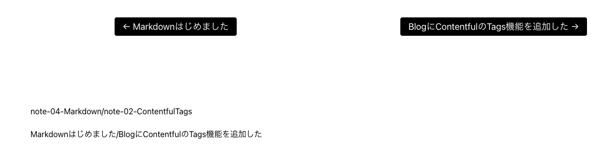

<section style="margin-bottom: 6em;">
Blogの記事がまだ少ないので気づいたのだが、スターターに始めからついていた
（←previous || next→）リンクがおかしかった。<br>
最新記事なのに前後記事があるとか、そもそも前と後に指している記事が違うとか。

まずTag機能やNotesコンテンツを後から増やした自分の責任を疑ったがBlogまわりのcreatePageは書き換えていない。<br>
gatsby-node.jsは、[元ソース](https://github.com/contentful/starter-gatsby-blog/blob/master/gatsby-node.js)と差がないなぁと眺めていて、（んん？）となった。

```js:title=gatsby-node.js
const posts = result.data.allContentfulBlogPost.nodes

if (posts.length > 0) {
	posts.forEach((post, index) => {
		const previousPostSlug = index === 0 ? null : posts[index - 1].slug
		const nextPostSlug =
		index === posts.length - 1 ? null : posts[index + 1].slug

		createPage({
			path: `/blog/${post.slug}/`,
			component: blogPost,
			context: {
				slug: post.slug,
				previousPostSlug,
				nextPostSlug,
				article: post,
			},
		})
	})
}
```

ここに問題はなさげだが、渡されているデータが

```js:title=gatsby-node.js
const result = await graphql(
    `
      {
        allContentfulBlogPost {
          nodes {
            title
            slug
          }
        }
      }
    `
  )
```
この **「allContentfulBlogPost」** はいったいどんな順番で配列化されているんだ？？ となった。<br>
答えを先に書くと、公開日降順でソートをかければ、新しい記事から配列に収まる。
```js:title=gatsby-node.js
allContentfulBlogPost(sort: { publishDate: DESC }) {
	nodes {
		.....
	}
}
```
数が少ないので、実際にgraphQLで見てみると、ソートなしの状態では次のような順番で表示された。

```
（2）Gatsby Code SyntaxHighlighter（-/4）		：code-syntaxHighlighter

（4）M2 Mac mini（2/5）		：m2-mac-mini
  
（5）2022年末の近況（4/6）		：2022

（6）決勝リーグ進出（5/1）		：FIFA-WC2022

（1）Gatsby Cloud（6/3）		：gatsby-cloud

（3）Mac mini M2 - 続き（6/-）		：Mac-mini-M2
```
いちばん新しい記事が
（1）Gatsby Cloud（6/3）で、（←previous || next→）リンクは（←6 / 3→）記事を指している<br>
コロン：以下は実際のSlug<br>
・・・アルファベット順でもID順でもないし、
createdAt、contentful_id、あたりを見たが、理由は判明しなかった。<br>

が、この記事を書きながらContentfulを見に行って一目瞭然。**Updated** つまり更新降順だ。なるほど。<br>
写真が重いとか誤字があったとか何かしらPostを開いて見ては上書き保存して、**Updated** がかなり前後したぐちゃぐちゃになった結果だが、早い時期に気づいて「更新順」だと知れて、むしろ良かったかも。

確かに後日訂正があった記事などは、上位に上げるのは仕様としてありだ。<br>
Blogトップページも同じ順番でPostを並べていたら、矛盾はない。<br>
うちの場合は、Blogのインデックスページが「公開日降順」なので、今回きちんと揃えたことになる。

<hr>

いやいや・・・元ソースの[blog.js](https://github.com/contentful/starter-gatsby-blog/blob/master/src/pages/blog.js)も**publishDate: DESC** で gatsby-node.js と矛盾してるミスだよね。<br>
まぁスターターとしては、それくらいは自分で学んだほうがいいよテンプレとして良い課題だったかしらん。
</section>

# せっかくなので、ついでにNotesにもナビを実装

<section style="margin-bottom: 4em;">
基本的には、このページのいちばん上のコード 
<blockquote>

**if (posts.length > 0) {&emsp;}** を模倣。

</blockquote>

表示ページ側でいろいろ細工するのが面倒で、必要なものは全部、**context:** で渡してもらうようにした。<br>
もっとスマートなやり方があったら知りたい😳


```js:title=gatsby-node.js
const notes = result.data.allMarkdownRemark.edges

if (notes.length > 0) {
  notes.forEach((note, index) => {
    const previousNotetSlug = index === 0 ? null : notes[index - 1].node.frontmatter.slug
    const previousNotetTitle = index === 0 ? null : notes[index - 1].node.frontmatter.title
    const nextNoteSlug = index === notes.length - 1 ? null : notes[index + 1].node.frontmatter.slug
    const nextNoteTitle = index === notes.length - 1 ? null : notes[index + 1].node.frontmatter.title

    createPage({
      path: `/notes/${note.node.frontmatter.slug}/`,
      component: notePost,
      context: {
        slug: note.node.frontmatter.slug,
        previous:previousNotetSlug,
        next:nextNoteSlug,
        previousTitle:previousNotetTitle,
        nextTitle:nextNoteTitle,
        id: note.node.id,
      },
    })
  })
}
```
</section>


```js:title=templates/note-post.js
const pagenav = get(this, 'props.pageContext')
```
テンプレート側で小道具：pageContextを受け取ったのを、まずは地味にStrings状態で見る。<br>


```html
<p>
	{pagenav.previous}/{pagenav.next}
</p>
<p>
	{pagenav.previousTitle}/{pagenav.nextTitle}
</p>　

```
<br>


<div style="border:solid;border-width:2px;border-color:#ddd;">
	
</div>

画像↑左下の感じでスラッグもタイトルも問題ないねーと確認したら、上のButtonタイプのリンクへ嵌め込む。

ブログのテーマなどによる所で、このスターターの場合は Flex / wrap / justify-content: space-between;<br>
FlexBoxのUListElementにテキストリンクだったのを先にButtonスタイルをつけていたSCSSなど持ってきて流用。


```html:title=templates/note-post.js
<nav>
	<ul className={styles.articleNavigation}>
	{pagenav.previous && (
			<li>
				<Link to={`/notes/${pagenav.previous}`} rel="prev">
					← {pagenav.previousTitle}
				</Link>
			</li>
		)}
		{pagenav.next && (
			<li>
				<Link to={`/notes/${pagenav.next}`} rel="next">
					{pagenav.nextTitle} →
				</Link>
			</li>
		)}
	</ul>
</nav>
```
これも最初は素でUListを書いておき、
代入演算子　{pagenav.previous && (&emsp;)}　と　{pagenav.next && (&emsp;)} で囲うと、最初の記事と最後の記事で矢印　→　←　がパッと消え、空値の処理がまずくないのを目視して完了。

最近石橋を叩きすぎなアマチュアismを発揮中。


<section style="margin-bottom: 4em;"></section>


