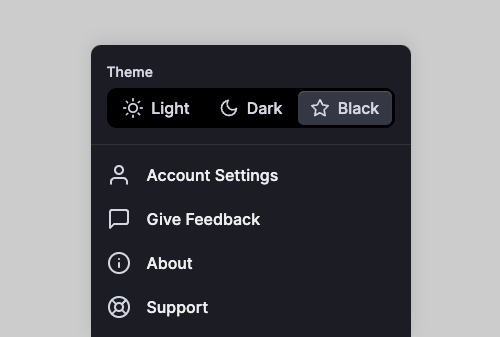

<section style="margin-bottom: 5em;">
もはやタイトルに曲名の余韻もない。<br>
Notesにはフィーチャーイメージなんぞいらねーと思ってたのに、JOJO-Tシャツ届くと人が変わる。<br>
横幅マイナスマージンまでかけて宣伝します。9部「ジョジョ・ランド」パラレルワールドのジョルノ来たよ💜

どんな悪いことやってくれるのか、今から楽しみだ。

</section>
<section style="margin-bottom: 6em;">
それにしてもGrapQLというのは便利すぎる。思い立って2分でデータ持って来れるとか目眩しますね。


```jsx
featuredImage {
	childImageSharp {
		gatsbyImageData(width: 2000, placeholder: BLURRED)
	}
}
```
表示側もほぼ4行だし

```jsx
let featuredImg = getImage(posts.frontmatter.featuredImage?.childImageSharp?.gatsbyImageData)

{featuredImg && (
<div className={styles.featuredImg}>
	<GatsbyImage image={featuredImg} />
</div>
)}
```

Gatsbyさんは異常に親切だし
[Working with Images in Markdown & MDX | Gatsby](https://www.gatsbyjs.com/docs/how-to/images-and-media/working-with-images-in-markdown/)

Gatsbyjs Markdown Staticimage でググって4分くらいでもう絵が出てるってどんなお世界。素敵。

</section>

<section style="margin-bottom: 4em;">

# gatsby-plugin-use-dark-mode + use-dark-mode

ダークモードは表題の2つを利用しました。<br>
おそらくは**gatsby-plugin-dark-mode** というプラグインを使った方が簡単だったのでは、と思います。<br>
いくつか読んでいた他所様の記事で失敗話もなく、スムーズにいくんだろうと予測。

私の場合は今回リベンジで、実のところサイトをつくって公開する前からダークモードはつけていました。<br>
つまり開発環境developでは容易かったということ。

まだNetlifyにホストしてた時にbuildしてもらえず、ダークモードの有無で公開を遅らせるのもなと、サイトヘッダーのナビゲーションなど「コメントアウト」してやり過ごしてたのを今回あらためて実装した経緯。

もちろんNetlifyに原因はなくて、Gatsby Cloudでも同じようにエラーになって、きちんとメッセージを読んで対応したら生きた。

インストールが少しだけ特殊なのかも。
```bash:title=bash
yarn add gatsby-plugin-use-dark-mode use-dark-mode
```
これで開発環境では即動くんだけども、package.jsonに書き込みがされず、紐付けされないものをBuildはできないですよとホスト先に断られる。

もっというと、publicフォルダをレンタルサーバーにごそっとアップしたら動いてました。まぁそこで自分の手が足りないだけと確信します。さらに開発者のおっさーんのサングラス顔を見て絶対強者を確信します。笑

[donavon (Donavon West) · GitHub](https://github.com/donavon)

<hr>

どうやらReactのバージョンが高くて、**--legacy-peer-deps** をオプションでつければ
**npm i use-dark-mode** でいけるんだろうな...というエラーメッセージ。（長いので転記しませんが）

```bash:title=bash
npm ERR! code ERESOLVE
npm ERR! ERESOLVE could not resolve
```
翻訳かけると<br>
ールートプロジェクトからのreact@「^18.0.0」を見つけました<br>
ピアreact@"^16.8.0" from use-dark-mode @ 2.3.1ー<br>
と、仲間だ依存だ競合だという英単語でなんとなーく状況を理解<br>

legacy-peerなんて言われるとちと不安になりますが、[use-dark-mode - npm](https://www.npmjs.com/package/use-dark-mode?activeTab=readme)　Weekly Downloads：12,590<br>
レガシーどころかバリ現役じゃん、これは私がpackage.jsonに記載させるとこまで漕ぎつければ何の問題もない。

ということで、gatsby-plugin-use-dark-modeプラグインと、カスタムReact Hook : use-dark-modeを1つずつ**npm i** して、package.jsonの変化をGitで確認してと手堅くゆっくりやりました。

</section>

<section style="margin-bottom: 8em;">

[use-dark-mode - npm](https://www.npmjs.com/package/use-dark-mode?activeTab=readme) の [Dependents (50)](https://www.npmjs.com/package/use-dark-mode?activeTab=dependencies) タブではけっこうな数のGatsby ThemaやStarterが載っていたので、躓いた方に見つけて欲しい。週に13,000て他のReact勢にも使われてますよね。
```bash:title=bash
npm i use-dark-mode --legacy-peer-deps
```
</section>

<section style="margin-bottom: 5em;">

## 三分岐のダークモードが欲しい。

三畳半の作業部屋では、LED電球2つ以外は真っ暗にしてモニターを見ているわたくし。<br>
生活がダークモードですが、このサイトのデフォルトは白でした。<br>

で、自分がよく見にいく2つのサイトが生粋のダークモード対応でOSに倣うタイプ。<br>
MacをLightモードにするのはきついし、ブラウザも同じく。<br>
たまーにOSをLightモードにして読んだりもするけど、暗い場所で明るいモードを見たい個人的な好みからすると[MDN](https://developer.mozilla.org/ja/)の3択が理想。

外観としては、Codepenで見かけた[Light / Dark / Black Theme](https://codepen.io/havardob/pen/dyOJyje)が全員嬉しい感。



ダークモードでも発色ゼロの漆黒Blackじゃないと目にきびしいという方もいれば、私は逆に「#000000」は、きつすぎてエディターのテーマなどでも敬遠します。<br>
「濃灰色」止まり。

このCodepenのをlocalStorage保存つきで実装できれば便利だと思うものの、書けない。
</section>

<section style="margin-bottom: 5em;">
既存のプラグインのコードを見ると、表題の三項演算子が大活躍なんですよね。<br>
二択はONとOFF、

disable
enable

true
false　だから確実であり小難しくないし、我儘なやつ以外はそれで十分と思われているダークモードはさておき。
</section>

<section style="margin-bottom: 6em;">
前記事でGatsby Head APIに移行した際に、それまで私はこの「三項演算子」をIF文だと思い込んで見てたんです。実態を知ると（おもしろいなー）となり、これ四項はないの？と冗談のようなことを考えて探しにいき、
あぁやっぱり 
<strong>
if-elseif-else
</strong>
なんだ ーな書き方を知りました。

[条件式が複数ある三項演算子に混乱した話 - Qiita](https://qiita.com/riekure/items/e510dba2e507403d990a?utm_source=pocket_saves)

```js
String str = 条件式1 ? 条件式2 ? "A" : "B" : "C";
```
条件1 & 条件式2 が正なら : A<br>
条件1 だけが正なら : B<br>
条件1 & 条件式2 が負なら : C<br>
条件1 が負で条件式2が正も : C<br>

且つ、または、and orで簡潔に文章化できないんですが

true && true = 1<br>
true && false = 2<br>
false && false = 3<br>
false && true = 3<br>

というよりは

```js
String str = "";
if (条件式1) & (条件式2):正 {
	str = "A";
} elseif (条件式1:正) {
	str = "B";
} else {
	str = "C";
}
```
条件1を主眼とした3分岐なんですね。<br>

最初はクソ真面目に↓の書き方をしてみたけど応えは4種あるようで、3種なんで、三項演算子の拡張版（？）と理解。<br>
楽しいなぁー。&emsp;IF(&emsp;)

```js
String str = "";
if (条件式1) & (条件式2):正 {
	str = "A";
} elseif (条件式1:正) {
	str = "B";
} elseif (条件式1) & (条件式2):負 {
	str = "C";
} elseif (条件式2:正) {
	str = "C";
}
```

人はたらればを云うなぁ！と言いますが、もし〜ならば、ほど美味いものあるかいっ　と思ったりします。うふ。

</section>

<!-- EOF -->